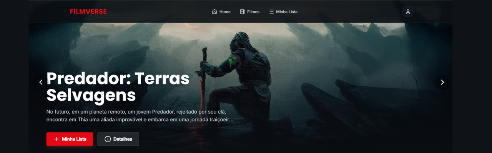
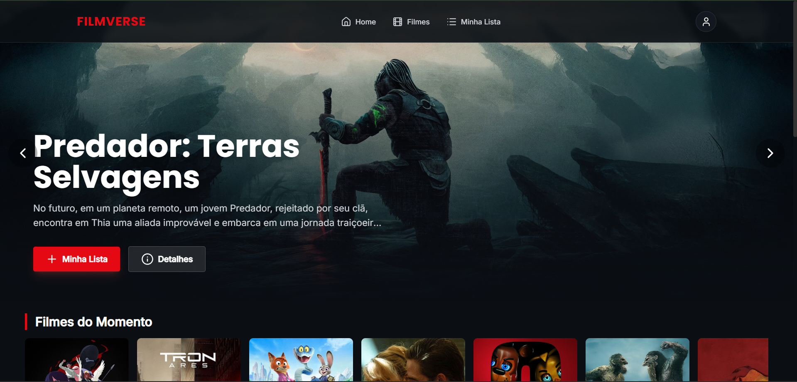
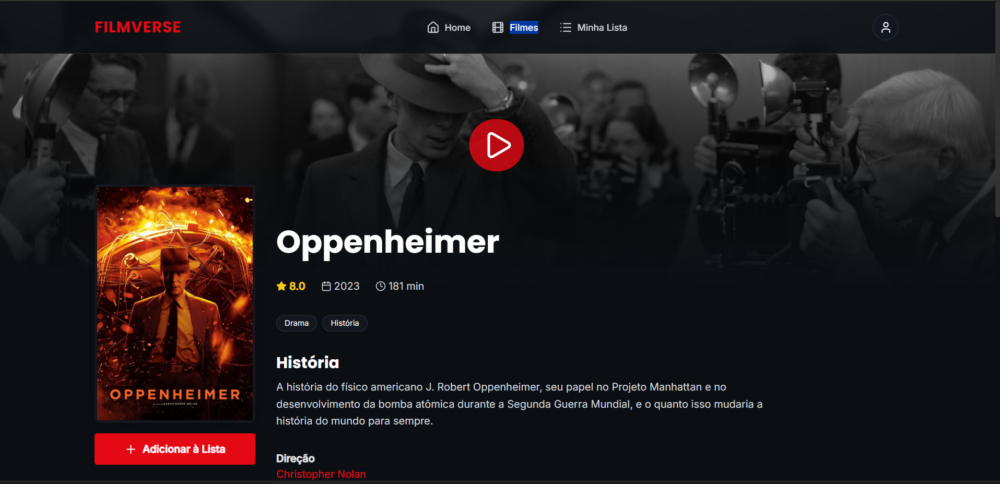
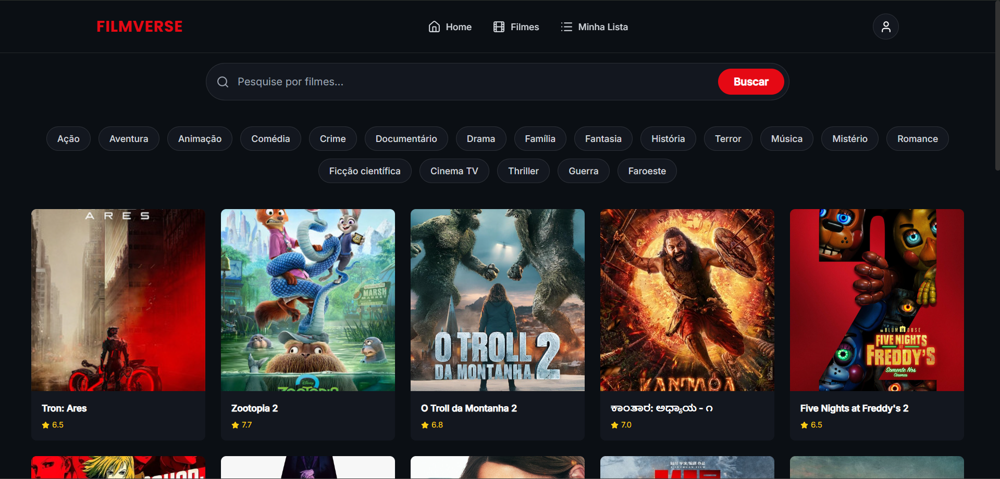

<p align="center">

  
</p>

<h1 align="center">🎬 FilmVerse</h1>
<p align="center">Uma plataforma de catálogo e avaliação de filmes, construída com a stack MERN e a API do TMDB.</p>

<p align="center">
  
  
  
  
  
</p>

---

## 📌 Sumário
- [📖 Sobre o Projeto](#-sobre-o-projeto)
- [✨ Funcionalidades](#-funcionalidades)
- [🎬 Demonstração](#-demonstração)
- [🛠️ Tecnologias Utilizadas](#️-tecnologias-utilizadas)
- [🚀 Como Rodar o Projeto](#-como-rodar-o-projeto)
- [🔑 Variáveis de Ambiente](#-variáveis-de-ambiente)
- [📡 Endpoints da API](#-endpoints-da-api)
- [👩‍💻 Autora](#-autora)

---

## 📖 Sobre o Projeto
**FilmVerse** é um projeto Full Stack criado para ser um portfólio completo e robusto, demonstrando habilidades na criação de aplicações web modernas, desde o backend até o frontend. A plataforma permite aos usuários explorar um vasto catálogo de filmes, pesquisar, filtrar e gerenciar uma lista de favoritos pessoal, com uma interface inspirada nas grandes plataformas de streaming.

O principal objetivo foi construir um sistema completo, integrando uma API externa de grande volume de dados (TMDB) com uma API REST própria para persistência de dados do usuário, focando em boas práticas de código, organização e uma experiência de usuário rica e intuitiva.

---

## ✨ Funcionalidades
- **Navegação e Descoberta:**
  - 🎞️ **Home Dinâmica:** Banner principal rotativo e automático com filmes populares.
  - 🧭 **Exploração por Gênero:** Seção visual para descobrir filmes por categoria.
  - 🔭 **Catálogo Completo:** Página dedicada com pesquisa por título e filtros por gênero.
  - 🔄 **Scroll Infinito:** Carregamento de mais filmes sob demanda conforme o usuário rola a página.
  - ℹ️ **Página de Detalhes Rica:** Informações completas com trailer, elenco, sinopse e filmes similares.

- **Gerenciamento de Lista Pessoal (CRUD):**
  - ✅ **Adicionar e Remover** filmes da lista pessoal.
  - 👀 **Marcar filmes** como "Assistido" ou "Não Visto".
  - 🗂️ **Filtros de Status** na lista pessoal.
  - 📱 **Modo de Visualização** em Grid ou Lista.

- **Experiência do Usuário (UX):**
  - 💅 **Notificações Modernas:** Feedback visual para todas as ações do usuário com `react-hot-toast`.
  - 🎨 **Design Responsivo:** Interface totalmente adaptável para desktop, tablets e celulares.

---

## 🎬 Demonstração


### Deploy
<p align="center">
  <a href="https://filmverse-amber.vercel.app/">
    
  </a>
</p>

### Screenshots
<p align="center">
  
  
  <br>
  
  
</p>

---

## 🛠️ Tecnologias Utilizadas
A stack do projeto foi escolhida para ser moderna, eficiente e alinhada com as demandas do mercado.

| Frontend | Backend | Banco de Dados |
|----------|---------|----------------|
| React.js | Node.js | MongoDB        |
| React Router | Express | Mongoose       |
| Tailwind CSS | CORS |                |
| Axios | Dotenv |                |
| React Hot Toast | | |
| Lucide React Icons | | |

---

## 🚀 Como Rodar o Projeto

> ⚠️ **Atenção:** É crucial configurar as variáveis de ambiente nos arquivos `.env` de ambos os projetos (frontend e backend) para que a aplicação funcione corretamente.

**1. Clone o Repositório**
```bash
git clone https://github.com/Bellapy/Filmverse.git
cd Filmverse
2. Backend
code
Bash
# Navegue até a pasta
cd backend

# Instale as dependências
npm install

# Crie o arquivo .env e configure as variáveis (veja a seção abaixo)

# Inicie o servidor
npm run dev
3. Frontend
code
Bash
# Em um novo terminal, navegue até a pasta
cd frontend

# Instale as dependências
npm install

# Crie o arquivo .env e configure as variáveis (veja a seção abaixo)

# Inicie a aplicação
npm run dev
Acesse http://localhost:5173 no seu navegador.


🔑 Variáveis de Ambiente
Para rodar este projeto, você precisará criar dois arquivos .env:

Na raiz de /backend:
code
Env
MONGODB_URI=SUA_STRING_DE_CONEXAO_DO_MONGODB_ATLAS

Na raiz de /frontend:
code
Env
VITE_TMDB_API_KEY=SUA_CHAVE_V3_DA_API_DO_TMDB

---

📡 Endpoints da API
A API REST do backend segue os seguintes endpoints:

Método	Endpoint	Descrição
GET	/api/movies	Lista todos os filmes da lista pessoal.
POST	/api/movies	Adiciona um novo filme à lista.
PATCH	/api/movies/:id	Atualiza o status "assistido" de um filme.
DELETE	/api/movies/:id	Remove um filme da lista pelo seu ID.

---

👩‍💻 Autora
Isabella Dreher Emerichs Da Rosa
Apaixonada por desenvolvimento Frontend, UI/UX e tecnologia. 


<p align="center">✨ Obrigada por acessar o Filmverse✨</p>