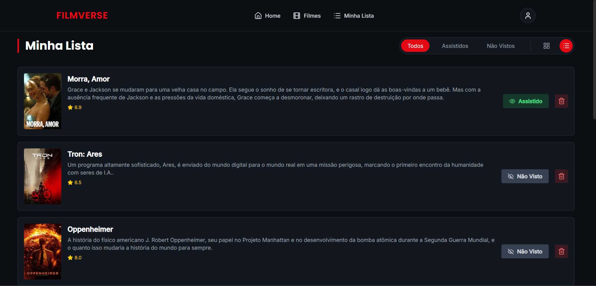

# ⭐ FilmVerse – Uma plataforma de catálogo e avaliação de filmes

> Projeto Full Stack completo que simula uma plataforma de streaming, permitindo aos usuários descobrir, pesquisar e organizar filmes em uma lista pessoal. A aplicação consome a API pública do TMDB para dados de filmes e utiliza uma API REST própria, construída com Node.js e Express, para gerenciar os dados do usuário em um banco MongoDB.

---

### 🛡️ Badges


---

### 📖 Descrição Detalhada

O FilmVerse foi criado para ser um projeto de portfólio robusto, demonstrando habilidades essenciais em desenvolvimento Full Stack. A aplicação resolve o problema de organizar e acompanhar filmes de interesse, oferecendo uma interface moderna e intuitiva inspirada nas grandes plataformas de streaming. O principal desafio foi integrar uma API externa (TMDB) com um sistema de CRUD próprio, criando uma experiência de usuário fluida e completa.

---

### 🎬 Demonstração

**Acesse a demonstração ao vivo:** **[Link para o seu deploy do Vercel/Netlify]**

#### 🎞️ GIF da Aplicação em Uso


#### 📸 Screenshots

**Página Inicial (Home)**
*Apresenta os filmes do momento em um banner rotativo e seções de descoberta por gênero.*


**Página de Catálogo (com Scroll Infinito)**
*Permite pesquisa por nome e filtro por gênero, carregando mais filmes conforme o usuário rola a página.*


**Página de Detalhes do Filme**
*Exibe informações ricas como trailer, elenco, sinopse e filmes similares.*


**Página "Minha Lista" (com filtros e modo de visualização)**
*Gerencie seus filmes salvos com filtros de status e alterne entre visualização em grid ou lista.*


---

### ✨ Funcionalidades

- **🔍 Descoberta e Pesquisa:**
  - Banner rotativo automático na Home.
  - Pesquisa de filmes por título.
  - Filtro de filmes por gênero.
  - Scroll infinito para carregar mais resultados.
- **⭐ Lista Pessoal (CRUD Completo):**
  - Adicionar e remover filmes da lista pessoal.
  - Marcar filmes como "Assistido" ou "Não Visto".
- **🎬 UX Avançada:**
  - Página de detalhes rica com trailer, elenco e recomendações.
  - Modo de visualização em Grid ou Lista.
  - Notificações toast para feedback de ações.
  - Design totalmente responsivo (mobile-first).

---

### 🛠️ Tecnologias Utilizadas

- **Frontend:**
  - `React.js`
  - `React Router`
  - `Tailwind CSS`
  - `Axios`
  - `Lucide React` (Ícones)
  - `React Hot Toast` (Notificações)

- **Backend:**
  - `Node.js`
  - `Express`
  - `MongoDB` com `Mongoose`
  - `CORS`
  - `Dotenv`

- **APIs:**
  - `The Movie Database (TMDB)`

---

### 🚀 Como Rodar o Projeto

Siga os passos abaixo para executar o projeto localmente:

**1. Clone o repositório:**
```bash
git clone https://github.com/[SEU-USUARIO]/filmverse.git
cd filmverse

2. Configure e rode o Backend:

Bash
cd backend
npm install
Crie um arquivo .env na raiz da pasta backend e adicione:

Env
PORT=5000
MONGODB_URI=SUA_STRING_DE_CONEXAO_DO_MONGODB_ATLAS
Para iniciar o servidor, rode:

Bash
npm run dev
3. Configure e rode o Frontend:

Bash
# Em um novo terminal
cd frontend
npm install
Crie um arquivo .env na raiz da pasta frontend e adicione:

Env
VITE_TMDB_API_KEY=SUA_CHAVE_V3_DA_API_DO_TMDB
Para iniciar a aplicação, rode:

Bash
npm run dev
Acesse http://localhost:5173 no seu navegador.


📁 Estrutura do Projeto

filmverse/
├── backend/
│   ├── src/
│   │   ├── controllers/
│   │   ├── models/
│   │   ├── routes/
│   │   ├── db.js
│   │   └── server.js
│   └── .env
│   └── package.json
├── frontend/
│   ├── src/
│   │   ├── components/
│   │   ├── pages/
│   │   ├── services/
│   │   ├── App.jsx
│   │   └── main.jsx
│   └── .env
│   └── package.json
└── README.md

🔑 Variáveis de Ambiente (.env)
O projeto requer as seguintes variáveis de ambiente para funcionar:
Backend (/backend/.env):
MONGODB_URI: A string de conexão com seu cluster do MongoDB Atlas.
Frontend (/frontend/.env):
VITE_TMDB_API_KEY: Sua chave de API (v3) do The Movie Database.
📡 Documentação da API (Backend)
Método	Endpoint	Descrição
GET	/api/movies	Lista todos os filmes da lista pessoal.
POST	/api/movies	Adiciona um novo filme à lista.
DELETE	/api/movies/:id	Remove um filme da lista pelo seu ID.
PATCH	/api/movies/:id	Atualiza o status "assistido" de um filme.

👨‍💻 Autor
Isabella Dreher Emerichs Da Rosa
LinkedIn: [Link para o seu LinkedIn]
GitHub: [Link para o seu GitHub]
